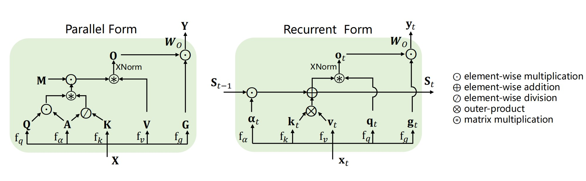

# MetaLA: Unified Optimal Linear Approximation to Softmax Attention Map

Yuhong Chou*, Man Yao*, Kexin Wang, Yuqi Pan, Ruijie Zhu, Yiran Zhong, Yu Qiao, Jibin Wu, Bo Xu, Guoqi Li

Paper: [https://arxiv.org/abs/2411.10741](https://arxiv.org/abs/2411.10741)  
Hugging Face Models: [Checkpoints 🤗](https://huggingface.co/Pantch/MetaLA)

🚀 Our paper has been accepted as **Oral in NeurIPS2024**.

## About MetaLA

Various linear complexity models (LinFormer, SSM, LinRNN) have been proposed. However, the optimal design of these linear models is still an open question. This work abstracts existing linear models into a _**unified linear attention form**_. We then identify _**necessary conditions**_ for achieving “optimal linear approximation to softmax attention map": 1) Dynamic memory ability; 2) Static approximation ability; 3) Least parameter approximation. We find that none of the current linear models meet all three conditions, resulting in suboptimal performance. Instead, we propose _**MetaLA**_ as a solution that satisfies these conditions. Our experiments on MQAR, language modeling, image classification, LRA, MAD, NIAH, and efficiency benchmark show the effectiveness of MetaLA.  



## Setup

Our training codebase relies on [GPT-NeoX](https://github.com/EleutherAI/gpt-neox). To launch pre-training with MetaLA, please refer to [Environment and Dependencies](https://github.com/EleutherAI/gpt-neox?tab=readme-ov-file#environment-and-dependencies) to get started:

```bash
git clone git@github.com:EleutherAI/gpt-neox.git
cd gpt-neox
pip install -r requirements/requirements.txt
```

We rely on [Flash Linear Attention](https://github.com/sustcsonglin/flash-linear-attention) to implement the Meta Linear Attention operator. For detailed installation, please refer to [Installation](https://github.com/sustcsonglin/flash-linear-attention?tab=readme-ov-file#installation):

```bash
pip install -U git+https://github.com/sustcsonglin/flash-linear-attention
```

Short convolution is implemented by [causal-conv1d](https://github.com/Dao-AILab/causal-conv1d):

```bash
pip install causal-conv1d>=1.4.0
```

## Pre-training

- Clone [GPT-NeoX](https://github.com/EleutherAI/gpt-neox) codebase.
- Add our [neox-style MetaLA](./gpt-neox/metala_qv_selfaug.py) implementation to `gpt-neox/megatron/model/metala`. You may need to add an entry for `ParallelMetaLALayer_selfaugPipe` in `gpt-neox/megatron/model/gpt2_model.py`.
- Create a configuration file in `gpt-neox/configs/metala.yml`. MetaLA supports half-precision training and inference (with bf16 or fp16).
- Run training with:

```bash
cd gpt-neox
python ./deepy.py train.py -d configs metala.yml local_setup.yml
```

For more detailed training process, please refer to [GPT-NeoX](https://github.com/EleutherAI/gpt-neox).

## Inference

[Here](./metala) is our hf-style implementation that supports text generation. You can run the following code to test the environment:

```python
from metala import MetaLAConfig, MetaLAForCausalLM

model = MetaLAForCausalLM(MetaLAConfig()).cuda()
print(model)
```

You can download our [released checkpoints](https://huggingface.co/Pantch/MetaLA) to perform generation as follows:

```python
import torch
from transformers import AutoModelForCausalLM, AutoTokenizer

PATH = 'your/path/to/hf/checkpoints'

tokenizer = AutoTokenizer.from_pretrained(PATH, padding_side='left', truncation_side='left', use_fast=True, trust_remote_code=True)
if tokenizer.pad_token is None:
    tokenizer.pad_token = tokenizer.eos_token

model = AutoModelForCausalLM.from_pretrained(PATH, trust_remote_code=True, torch_dtype=torch.bfloat16).cuda()
model.eval()
print(model)

prompts = ["Austria, is a landlocked country in Central Europe", "小米公司",]
inputs = tokenizer(prompts, padding=True, truncation=True, max_length=512, return_tensors='pt').to('cuda')
print(inputs.input_ids.shape)

outputs = model.generate(inputs.input_ids, do_sample=False, max_new_tokens=256, attention_mask=inputs.attention_mask)
response = tokenizer.decode(outputs[0], skip_special_tokens=True)
print("=====Begin======")
print(response)
```

We also provide a simple example [here](./test_generation.py).

## Available Models

We released MetaLA checkpoints ranging in size from 380M to 3B, all trained with 300B tokens. Dowload from [here 🤗](https://huggingface.co/Pantch/MetaLA).

Some results on the CommonSense Reasoning benchmark are  as follows:

|Models|PS|T| BOOLQ| PIQA |HS| WG| ARC-E| ARC-C|ОBQA|Avg|
|-|-|-|-|-|-|-|-|-|-|-|
|LLaMA2|0.41|300|54.04|67.19|38.75|52.17|49.24|23.72|30.00|45.02|
|MetaLA|0.38|300|60.09|67.79|38.51|50.99|52.19|25.60|30.00|46.45|
|-|-|-|-|-|-|-|-|-|-|-|
|LLaMA2|1.0|300|56.42|69.97|47.04|52.72|57.07|28.16|32.60|49.14|
|MetaLA|1.0|300|59.05|69.37|46.43|54.38|57.41|26.96|33.00|49.52|
|-|-|-|-|-|-|-|-|-|-|-|
|LLaMA2|3.0|300|61.31|73.18|57.88|59.59|63.93|31.40|34.00|54.47|
|MetaLA|3.0|300|62.84|74.16|59.25|58.80|64.52|33.28|35.80|55.52|

## Citation

If you find our work useful, please consider citing MetaLA:

```html
@inproceedings{choumetala,
  title={MetaLA: Unified Optimal Linear Approximation to Softmax Attention Map},
  author={Chou, Yuhong and Yao, Man and Wang, Kexin and Pan, Yuqi and Zhu, Rui-Jie and Wu, Jibin and Zhong, Yiran and Qiao, Yu and Bo, XU and Li, Guoqi},
  booktitle={The Thirty-eighth Annual Conference on Neural Information Processing Systems}
}
```
